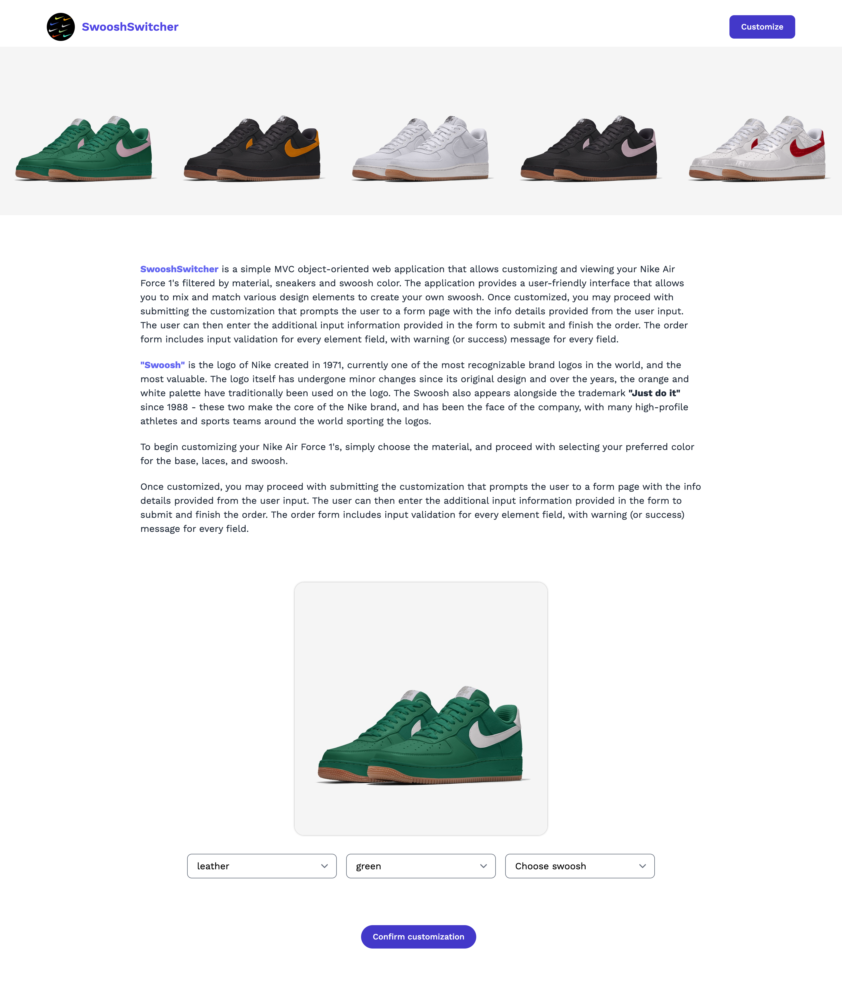
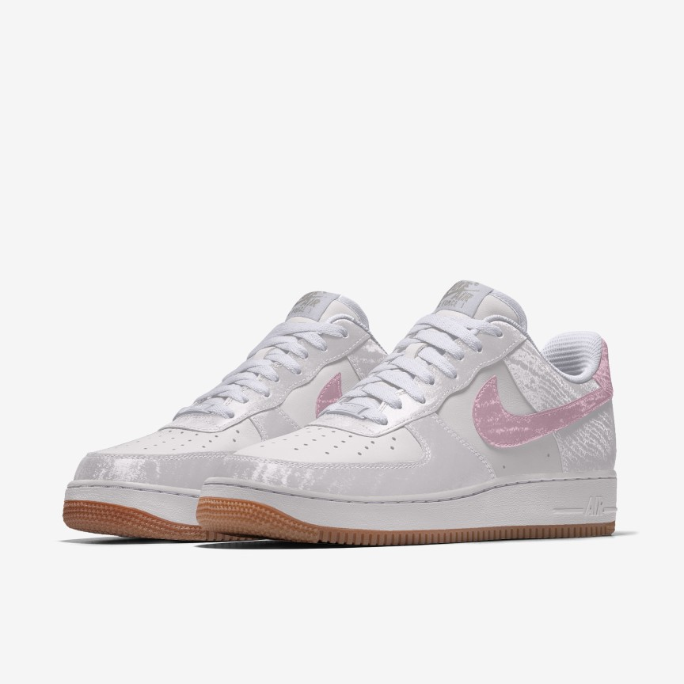
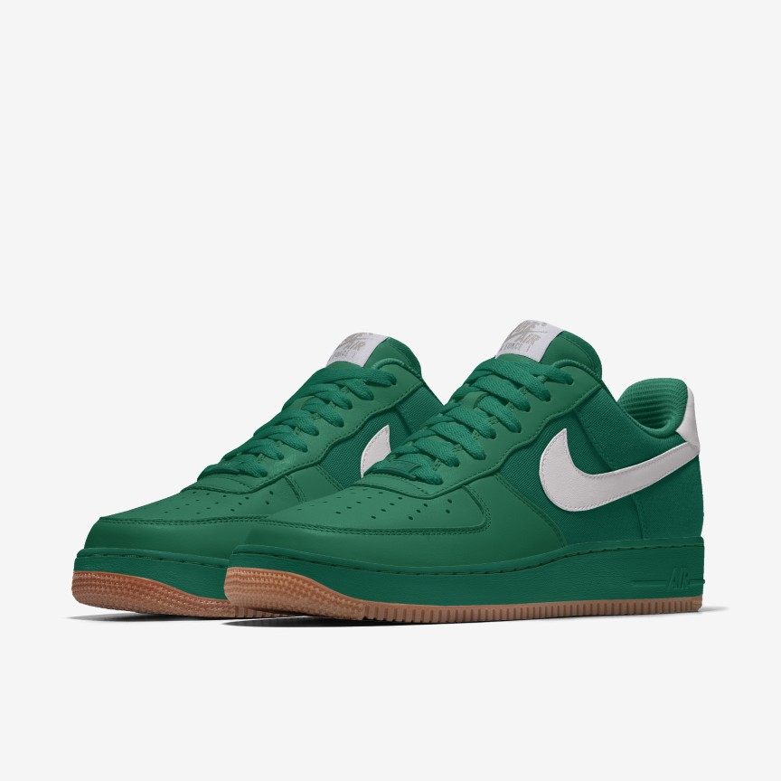
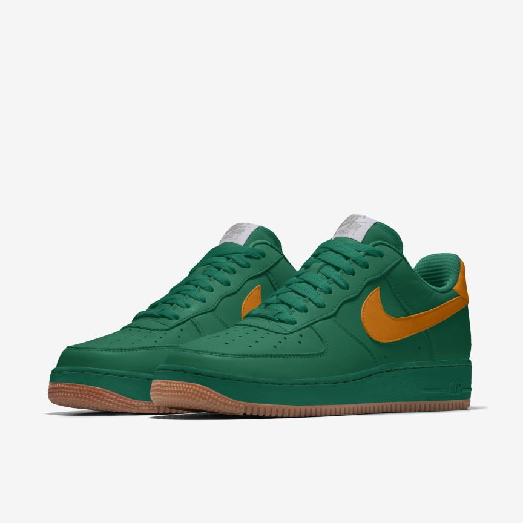
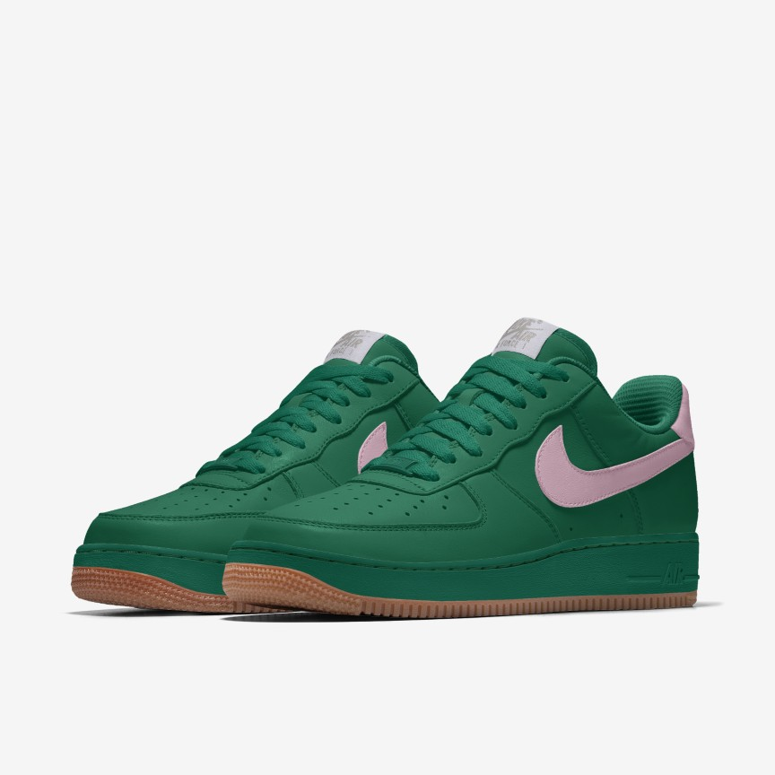

<!-- PROJECT -->
 
<h1 align="center">SwooshSwitcher</h3>

<!-- ABOUT PROJECT -->
## About

SwooshSwitcher is a simple MVC object-oriented web application
that allows customizing and viewing your Nike Air Force 1's filtered by material, sneakers and swoosh
color. The application provides a user-friendly interface that allows you to mix and match various design
elements to create your own swoosh. Once customized, you may proceed with submitting the customization 
that prompts the user to a form page with the info details provided from the user input. The user can then enter the additional input information provided in the form to submit and finish the order. The order form includes input validation for every element field, with warning (or success) message for every field.

"Swoosh" is the logo of Nike created in 1971, currently one
of the most recognizable brand logos
in the world, and the most valuable. The logo itself has undergone minor changes since its original
design and over the years, the orange and white palette have traditionally been used on the logo. The
Swoosh also appears alongside the trademark "Just do it" since 1988 - these two make the core of
the Nike brand, and has been the face of the company, with many high-profile athletes and sports teams
around the world sporting the logos.

<!-- TECHNOLOGY -->
## Technology

* [![javascript][javascript]][javascript-url]
* [![tailwindcss][tailwindcss]][tailwindcss-url]
* [![html5][html5]][html5-url]
  * [![css3][css3]][css3-url]

<!-- RESOURCES -->
## Resources

* [Nike](https://www.nike.com/hr/nike-by-you)
    
<!-- CONTACT -->
## Contact

[![linkedin][linkedin]][linkedin-url]
[![email][email]][email-url]

<!-- MARKDOWN LINKS & IMAGES -->
<!-- https://www.markdownguide.org/basic-syntax/#reference-style-links -->
[linkedin]: https://img.shields.io/badge/-LinkedIn-black.svg?style=for-the-badge&logo=linkedin&colorB=555
[linkedin-url]: https://www.linkedin.com/in/jurajstefanic/
[email]: https://img.shields.io/badge/email-555?style=for-the-badge&logo=gmail&logoColor=white
[email-url]: mailto:jurajstefanic@outlook.com
[javascript]: https://img.shields.io/badge/javascript-F7DF1E?style=for-the-badge&logo=javascript&logoColor=white
[javascript-url]: https://javascript.com
[tailwindcss]: https://img.shields.io/badge/tailwindcss-06B6D4?style=for-the-badge&logo=tailwindcss&logoColor=white
[tailwindcss-url]: https://tailwindcss.com/
[html5]: https://img.shields.io/badge/html-E34F26?style=for-the-badge&logo=HTML5&logoColor=white
[html5-url]: https://www.w3schools.com/html/
[css3]: https://img.shields.io/badge/css3-1572B6?style=for-the-badge&logo=css3&logoColor=white
[css3-url]: https://www.w3schools.com/css/